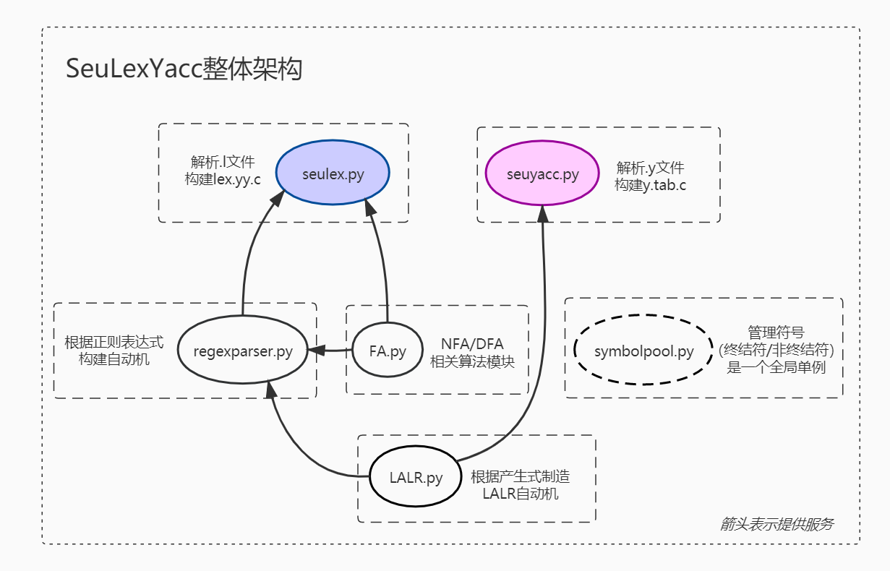

## 1 编译对象与编译功能

### 1.1 编译对象

C语言全集。详见本报告目录下的`c99.l`文件与`c99.y`文件。

### 1.2 编译功能

- NFA确定化、DFA最小化，实现位于`FA.py`。
- 根据正则表达式构建DFA，实现位于`regexparser.py`。
- 根据产生式构建LALR自动机，实现位于`LALR.py`。
- 解析`.l`文件，生成`lex.yy.c`，实现位于`seulex.py`。
- 解析`.y`文件，生成`y.tab.c`，实现位于`seuyacc.py`。

## 2 主要特色

- 对正则表达式语法较为全面的支持，可以**不经修改**直接解析`c99.l`中定义的所有正则表达式。

  具体来说，支持的规则有：

  - `[]`定义字符集，支持`-`表示范围，支持`^`表示补集。
  - `*+?|`算符。
  - `()`定义优先级。
  - `{}`中的标识符表示先前定义的正则表达式。
  - `""`之间的内容被当作普通字符。
  - `\`表示转义。

- 正则表达式解析器是通过LALR方法由程序构建的，因此，扩展正则表达式的语法相对容易。

- seulex执行效率高，跑完`c99.l`只需要几秒钟。

- seuyacc执行效率高，跑完`c99.y`只需要几秒钟。

- seulex可以解决冲突：最长前缀优先，此基础上先列出的模式优先。

- seuyacc使用LALR方法构建自动机，语法分析表规模相对较小。并且使用了高效的LALR自动机构建方法（向前看符号传播法）。

- 支持`.y`文件中定义运算符优先级、结合性，对于没有指定结合性的运算符，默认左结合，对于没有指定优先级的运算符，默认它的优先级最低。

- 支持`.y`文件中给产生式指定优先级（以解决移入-归约冲突），对于没有指定优先级的产生式，默认它的优先级等同于它右部最右一个非终结符号的优先级。

- 当LALR分析中遇到归约-归约冲突时，总是选择在`.y`文件中列在前面的产生式进行归约。

- 支持`.y`文件中给产生式绑定动作，可以使用`$$`和`$x`获取与符号绑定的变量值。

- 支持`.l`文件中给词法规则绑定动作，每个动作需要以返回一个整型值（Token类型编号）结尾。

- 由seulex生成的`lex.yy.c`需要与由seuyacc生成的`y.tab.c`共同编译，也可以通过本报告中提供的`lexyycdriver.c`与`lex.yy.c`共同编译从而单独使用词法分析器。

## 3 概要设计与详细设计

### 3.1 概要设计



- `FA.py`中定义了NFA与DFA的数据结构，集成了有关它们的各种算法。
- `LALR.py`负责根据产生式构建LALR自动机。
- `regexparser.py`负责根据正则表达式构建DFA。它使用了`FA.py`与`LALR.py`提供的功能。
- `seulex.py`负责解析`.l`文件，生成`lex.yy.c`文件。它使用了`regexparser.py`和`FA.py`提供的功能。
- `seuyacc.py`负责解析`.l`文件，生成`y.tab.c`文件。它使用了`LALR.py`提供的功能。
- `symbolpool.py`负责全局范围内的符号（终结符、非终结符）管理，其中包含一个单例对象，此对象为上述所有模块共用。

### 3.2 详细设计

#### 3.2.1 symbolpool.py

- `class Symbol`

  **符号类**。

  主要成员变量：

  - `id:str`，符号全局范围内的唯一id，字符串类型。若想在项目的其他程序中获取某个符号，应当使用此id。
  - `terminal:bool`，符号是否是（词法分析或语法分析的）终结符。
  - `terminal_id:int`，若此符号是词法分析中可以出现在输入流中的终结符，那么此符号拥有一个唯一整数id，此id通常是单一字符的ASCII码。特别地，我们规定那些在词法分析中不可能出现在输入流中的终结符（例如`eps`）的`terminal_id`为`-1`。

- `class SymbolPool`

  **符号池类**。

  主要成员方法：

  - `getSymbol(id:str,terminal=True,autocreate=False,terminal_id=None)->Symbol`，根据符号的id获取此符号对象。除了第一个参数，其他均为可选参数。当`autocreate=True`时，若欲取出的符号id不存在，则会自动创建该符号对象。

- `so:SymbolPool`

  一个**符号池实例**，为全局范围所公用。

#### 3.2.2 FA.py

-  `class FA`

  **NFA与DFA类**（我们将DFA看作一种特殊的NFA）。

  主要成员方法：

  - `move(T:list<int>,a:Symbol)->frozenset<int>`

    T是一个节点编号列表，a是一个符号，此函数返回一个节点编号集合，表示T中的所有节点经过符号a一步能够转移到的所有节点的编号。

  - `closure(T:list<int>)->frozenset<int>`

    T是一个节点编号列表，返回一个节点编号集合，表示是T的epsilon闭包。


**McMaughton-Yamada-Thompson算法相关：**

- `nfa_link(g:FA,f:FA)->FA`

  将两个NFA串联，返回结果。

- `nfa_or(g:FA,f:FA)->FA `

  将两个NFA并联，返回结果。

- `nfa_oneormore(g:FA)->FA`

  若传入NFA（g）所对应的语言是`L`，那么返回的NFA的语言是`L+`。

- `nfa_star(g:FA)->FA`

  若传入NFA（g）所对应的语言是`L`，那么返回的NFA的语言是`L*`。

- `nfa_oneornot(g:FA)->FA`

  若传入NFA（g）所对应的语言是`L`，那么返回的NFA的语言是`L?`。

- `merge(nfa_list:list<FA>)->FA,list<dict<int,int>>`

  将若干个NFA合并成1个NFA，重新分配节点编号。

**NFA确定化以及DFA最小化：**

- `get_dfa_from_nfa(nfa:FA,fn_info_node:lambda)->FA`

  **NFA确定化**，参数`fn_info_node`是一个函数，最终的DFA中的节点的附加信息是通过它所包含的原NFA节点的附加信息生成的，这个生成过程由参数`fn_info_node`定义。

- `minimized_dfa(dfa:FA,fn_partition_id:lambda,fn_info_node)->FA`

  **DFA最小化**，参数`fn_partition_id`是一个函数，用以确定初始划分，参数`fn_info_node`也是一个函数，用以生成节点的附加信息。

**其他函数：**

- `draw_mermaid(g:FA)`

  将NFA以`mermaid`格式（一种有向图绘制语言）打印。

#### 3.2.3 LALR.py 

- `class Production`

  产生式类。
  
  主要成员变量：
  
  - `lhs:Symbol`，产生式左边符号。
  - `rhs:list<Symbol>`，产生式右边符号列表。
  - `id:int`，产生式id，此id作用仅仅是标识产生式定义的顺序（先定义的id更小）。而标识产生式本身，我们直接使用实例本身，这样做可行是因为python本身就给每一个实例分配了一个唯一的全局id。
  
- `class ProductionPool`

  产生式池。管理所有产生式。

  主要成员方法：

  - `add(p:Production,priority:int=None)`

    向池中添加一个产生式，并指定优先级（可选）。

  - `getProdsOf(L:Symbol)->list<Production>`

    获取以符号L为左部的所有产生式组成的列表。

- `class Item`

  LR0项。

  主要成员变量：

  - `p:Production`，项的产生式。
  - `dot:int`，项的读头位置，从0开始计数。

- `class ItemPool`

  LR0项池。管理所有LR0项。

  主要成员方法：

  - `getItem(p:Production,dot:int)->Item`

    根据产生式、读头位置取出对应的项。若该项不存在于池中，则创建之。

- `class State`

  LR0状态。

  主要成员变量：

  - `_items:set<Item>`

    存储该状态的所有LR0项。

  - `_edges:dict<Symbol,State>`

    存储了该状态的所有出边。

  - `reduceinfo:dict<Symbol,dict>`

    存储了该状态对于不同向前看符号的归约信息，每个符号的归约信息的格式见下面的成员方法`getReduceInfo`。

  主要成员方法：

  - `add(item:Item)`

    给状态添加1个项。

  - `addEdge(x:Symbol,V:State)`

    给状态添加1条出边。

  - `genReduceInfo()`

    生成状态的所有归约信息，此函数需要借助于向前看符号管理者（后面会介绍）来生成归约信息，因而需要在向前看符号管理者就绪后再调用。

  - `getReduceInfo(x:Symbol)->dict`

    获取当向前看符号是x时的归约信息，格式为`{'p':Production,'reduce_len':int,'reduce_to':Symbol}`。

  - `getToBy(x:Symbol)->State`

    获取经由符号x转移到的下一个状态，若无法转移，返回None。

- `class LookaheadKeeper`

  向前看符号管理者。此类的作用是给LR0状态维护向前看符号，从而使LR0状态升级为LALR状态。

  主要成员方法：

  - `addLookaheads(I:State,item:Item,LAs:list<Symbol>)`

    给状态I中的项item添加向前看符号列表LAs。

  - `getLookaheads(I:State,item:Item)->set<Symbol>`

    获取状态I中项item的向前看符号集合。

  - `initLookaheads()`

    高效构造LALR语法分析表算法中的初始化部分：确定哪些向前看符号是自发生成的，以及向前看符号的传播关系。

  - `propagateLookaheads()`

    高效构造LALR语法分析表算法的后半部分。即使用不动点方法，不断传播向前看符号直到没有改变发生。

**自动机构造算法相关：**

- `CLOSURE_LR0(I:State)->State`

  计算状态I的LR0闭包。

- `CLOSURE_LR1(I:State,h:dict<item,set<Symbol>>)->State,dict<item,set<Symbol>>`

  计算状态I的LR1闭包，其中I的每个项的向前看符号列表由h给出。

- `GOTO(I:State,X:Symbol)->State`

  返回状态I经由符号X转移到的新的LR0状态的闭包。

- `FIRST(L:list<Symbol>)->set<Symbol>`

  获取一个语言的first符号集合，该语言由一个符号列表表示。如果结果为空集，则将`eps`加入集合。

- `FIRST_INIT()`

  由不动点法求出所有非终结符的first集合。

**此模块对外提供的接口：**

- `addProduction(lhs:Symbol,rhs:list<Symbol>,priority:int=None)->Production`

  添加产生式，返回新制造的产生式本身。priority数值越大，产生式优先级越高（用以解决移入-归约冲突）。

- `addProductionDone(start:Symbol)`

  在所有产生式添加完毕后的收尾工作，同时指定文法开始符号。

- `setTerminalAssoci(x:Symbol,asscoci:str)`

  设定终结符的结合性（以解决移入-归约冲突）。`asscoci`接收的值有`'left'`和`'right'`。

- `setTerminalPriori(x:Symbol,priority:int)`

  设定终结符的优先级（以解决移入-归约冲突）。`priority`数值越大，优先级越高。

  需要注意的是，需要先指定终结符的优先级，再添加产生式。这是因为产生式默认的优先级是其右部最右终结符的优先级，若在添加产生式之后再指定终结符的优先级，那么产生式的优先级并不会被更新。

- `build()`

  在前述方法均已合适调用后，调用此方法进行LALR自动机的构建。构建过程分为三阶段：计算各个符号的first集合、生成所有LR0状态、将LR0状态升级为LALR状态。

- `actions()`

  python生成器（generator）。用以遍历LALR分析表中所有有动作的项目。每次迭代得到一个四元组：`(i,x,a,t)`，含义为`(LALR状态编号,下一个符号,动作信息,动作类型)`。

- `getShiftInfo(i:int,x:Symbol)->int`

  得到编号为i的状态通过符号x转移到的下一个状态的编号。若无法转移，返回None。

- `getReduceInfo(i:int,x:Symbol)->dict`

  获取编号为i的状态在下一个符号是x的情况下的归约信息，归约信息的格式见`State`类中的`getReduceInfo`成员方法。

- `getAction(i:int,x:Symbol)`

  获取编号为i的状态在下一个符号是x的情况下的动作（移入或归约），返回一个二元组`(info,t)`，t是字符`'r'`或`'s'`或空字符，分别表示归约或移入或无动作，info是归约信息或移入信息，如果是移入信息，那么它是一个整数，如果是归约信息，那么它的格式参见上面的`getReduceInfo`方法。

#### 3.2.4 regexparser.py

**此模块对外提供的接口：** 

- `build()`

  初始化构建（根据正则语言的产生式构建LALR自动机）。

- `clear()`

  清空输入队列、符号栈。每次解析一个新的正则表达式，都应当先使用此方法。

- `pushseq(seq:list<str>)`

  将一个字符列表推入输入队列。

- `pusheos()`

  将结束符推入输入队列。

- `step()->bool`

  进行一步LR解析，若顺利进行返回True，若解析完成或解析出错返回False。

- `parse()`

  反复调用`step()`直到返回值为False。

- `show_stacks()`

  打印LR符号栈。

- `draw()`

  将对正则表达式的解析结果绘制成语法树显示。
  
- `get_final_nfa()->FA`

  获取构建完成的NFA。

- `add_nfa(name:str,nfa:FA)`

  将一个nfa以name命名装入缓存。

- `get_nfa_of_term(name:str)->FA`

  按照名称从缓存中取出一个nfa。

**LALR自动机相关：**

- `bind_action(p:Production,action_id:int)`

  给产生式绑定动作，`action_id`指定了某个动作函数。

- `define_actions()`

  定义了所有动作函数，并且给它们各自分配了唯一的id。

  每一个动作函数都是形如：`actionfunc(a:dict,a_ch:list<dict>)`，`a`是产生式左边符号的属性字典，`a_ch`是产生式右边每个符号的属性字典组成的列表。

- `build()`

  定义正则语言的所有产生式并给每个产生式绑定动作，通过`LALR`模块提供的接口构建LALR自动机。

**正则语言相关：**

- `get_char_range(syba:Symbol,sybb:Symbol)->set<Symbol>`

  `syba`和`sybb`都是字符终结符，返回ASCII码介于这两者之间（包含它们本身）的所有字符终结符所构成的集合。

- `dot_chars_but(sybset:set<Symbol>)->set<Symbol>`

  返回除了`sybset`中的符号以外，`.`可以代表的所有符号所构成的集合。

- `_regex_metachar:str`

  全局变量，其值为`'+*?'`。

- `_regex_specialchar:str`

  全局变量，定义了除了`_regex_metachar`以外的，需要转义的字符。

- `_regex_normalchar:str`

  全局变量，定义了除了上述两种符号之外的其他的正则语言所接受的符号。

#### 3.2.5 seulex.py

- `class Writer`

  负责通过模板生成`.c`文件。模板是指生成`.c`文件的框架，它也是一个`.c`文件，其中使用`$$$`表示需要被替换的部分。

  主要成员函数：

  - `__init__(framefile:str,outputfile:str)`

    构造函数，需要传入模板文件路径、输出文件路径。

  - `writeDown()`

    生成`.c`文件。调用此函数之前在Writer上的任何操作都是对内存的操作，当这些操作结束时，调用`writedown()`从而生成`.c`文件。

- `class LexWriter(Writer)`

  在Lex中特定化的Writer。

  主要成员函数：

  - `writeToHeaders(s:str)`

    把s的内容写入模板文件的头文件定义部分。

  - `writeToFunctions(s:str)`

    把s的内容写入模板文件中用户函数定义部分。

  - `writeToActions(s:str)`

    把s的内容写入模板文件中规则动作定义部分。

  - `writeToDfa(s:str)`

    把s的内容写入DFA初始化的部分。

- `class LexReader`

  此类中集成了一系列方法，用以读入`.l`文件中的基本单元。

  主要成员方法：

  - `__init__(filename:str)`

    构造函数，`filename`指定了`.l`文件的路径。

  - `peek(k:int=1)->str`

    返回输入流中接下来的k个字符。

  - `skipc（chs:str)`

    跳过输入流中的指定字符，这些字符由`chs`指定。

  - `skipBlankLines()`

    跳过输入流中从下一个字符开始的所有空行。

  - `readLine()->str`

    读入一行并返回之。

  - `readString()->str`

    读入一个字符串并返回之，当遇到空格、tab、换行符、文件尾时终止读入。

  - `readRegex()->str`

    读入一个正则表达式并返回之。并且在读入的过程中顺便处理`""`（双引号），即将双引号去掉，并将其中的特殊字符加以转义。

  - `readBlock()->str`

    读入一对匹配的`{}`（花括号）中的内容并返回之。出现在`''`（单引号）或`""`（双引号）之中的`{}`不参与匹配。

  - `readable()->bool`

    返回是否遇到文件尾，遇到返回False。

- `class LexProcessor`

  负责解析`.l`的类，它借助于`LexWriter`和`LexReader`以及`regexparser`模块和`FA`模块完成对`.l`文件的解析和`.c`文件的生成。

  主要成员函数：
  
  - `__init__(reader:LexReader,writer:LexWriter)`
  
    构造函数。
  
  - `step()`
  
    进行一步解析动作。`LexProcessor`是以有限状态自动机的方式实现的，每次调用`step()`都会从输入流中读入某些内容，执行某种动作，状态也有可能发生改变。
  
  - `addDefinition(term:str,reg:str)`
  
    添加一个正则表达式定义，这将解析这个正则表达式，并且构建出它的NFA并保存到缓存中。`term`是改正则表达式的标识符，`reg`是正则表达式。
  
  - `addRule(reg:str,c_code:str)`
  
    给一个正则表达式添加一个匹配动作。`reg`是正则表达式，`c_code`是用户定义的C语言代码片段。这个代码片段要以`return XXX;`结尾，`XXX`是一个整数（也可以是宏定义），它表示该正则表达式匹配的TOKEN类型。
  
  - `addUserCCode()`
  
    将`.l`文件中剩下的部分（用户自定义C代码）原封不动地复制到生成的`lex.yy.c`的特定部分。
  
  - `buildFinalDFA()`
  
    将所有先前生成的NFA整合成一个大的NFA，并进行确定化和最小化。
  
  - `genLexyyc()`
  
    生成`lex.yy.c`文件，此前，所有的写入动作只是写入内存，现在，将内存中保存的结果写入`lex.yy.c`文件。


#### 3.2.6 seuyacc.py

- `class YaccReader(LexReader)`

  复用了`LexReader`，未作任何拓展。负责读取`.y`文件中的基本单元，成员函数见上文`LexReader`中的介绍。

- `class YaccWriter(Writer)`

  `Writer`类是在`seulex.py`中定义的通用写者类，负责向模板中特定部分填写指定的内容。`YaccWriter`是对`Writer`的定制化类。负责向Yacc生成文件`y.tab.c`的模板`ytabframe.c`中特定部分填写指定的内容。

  主要成员函数：

  - `writerToHeaders(s:str)`

    将`s`的内容写入头文件定义部分。

  - `writeToFunctions(s:str)`

    将`s`的内容写入用户函数定义部分。

  - `writeToActions(s:str)`

    将`s`的内容写入用户动作（产生式匹配动作）定义部分。

  - `writeToLALR(s:str)`

    将`s`的内容写入LALR自动机初始化部分。

- `class YaccProcessor`

  负责解析`.y`的类，它借助于`YaccWriter`和`YaccReader`以及`LALR`模块完成对`.y`文件的解析和`.c`文件的生成。

  主要成员函数：

  - `step()`

    进行一步解析动作。`YaccProcessor`是以有限状态自动机的方式实现的，每次调用`step()`都会从输入流中读入某些内容，执行某种动作，状态也有可能发生改变。

  - `addToken(word_list:list[str])`

    Token是指在`.y`文件中以`%token`标记的标识符，这些标识符将被当作终结符来处理。`word_list`是一个字符串列表，每个字符串是一个在`.y`文件中以`%token`标记的标识符。

  - `declAssociation(word_list:list[str],associ:str)`

    给`word_list`中的字符串所表示的标识符定义结合性以及优先级，`associ`的取值是`'left'`或`'right'`。关于优先级，`word_list`中的符号具有相同的优先级，每次调用`declAssociation`时，它分配给符号的优先级比上一次调用时大1（优先级越大，越优先）。

  - `declStart(word:str)`

    定义文法开始符号。

  - `assignYaccId(syb:Symbol)`

    Yacc中符号的ID指的是该符号在最终的语法分析器`y.tab.c`中标识该符号的唯一整型值。对于终结符号（Token），它的ID是由用户在`.l`的头文件部分中定义的，对于非终结符号，我们需要在Yacc中生成它的ID，此函数即是给`syb`分配一个唯一的ID，此ID将用于`y.tab.c`中作为该符号的唯一标识。

    需要注意的是，我们约定用户在`.l`中定义的Token ID的值在区间`[256,499]`之间。这是因为，`[0,255]`是保留给字符终结符的ID，即它们的ASCII码，而`assignYaccId`函数生成非终结符号ID的基点是500，此值可以修改，它保存在`YaccProcessor`的成员变量`_id_of_nonter_base`中。

  - `getYaccId(syb:Symbol)`

    获取符号`syb`的ID。此ID含义和`assignYaccId`函数中的叙述相同。

    当`syb`是非终结符时，直接返回该符号的标识符文本。非终结符的标识符文本只有两种情况，一是在`.l`文件中的宏定义，例如`IDENTIFIER`，二是由单引号包裹的单个字符（或转义字符），例如`'a'`、`'\n'`。

    当`syb`是终结符时，返回它由前述`assignYaccId`方法所分配的整型ID。

    特别地，当`syb`是文件尾符号时，返回值为0，当`syb`时文法开始符号（准确地说，是增广LR文法的开始符号，而非`.y`文件中标记的文法开始符号）时，返回值为-2。

  - `addProduction(lhs:str,rhs:list,action:str,pri:int)`

    添加一个产生式。`action`是该产生式的归约动作，是一个C语言片段，其中可以使用`$$`表示产生式左部符号的属性值（整型），可以使用`$i`表示产生式右部第`i`个符号（i从1开始计数）的属性值（整型）。`pri`是该产生式的优先级，如果不指定，则标记该产生式的优先级为它的右部最右一个非终结符号的优先级。

  - `genYtabc()`

    生成`y.tab.c`文件，此前，所有的写入动作只是写入内存，现在，将内存中保存的结果写入`y.tab.c`文件。

#### 3.2.7 lexyyframe.c

此文件是seulex生成文件`lex.yy.c`的模板。在此文件中使用一个以`$$$`开头且仅含有这三个字符的一行表示一个需要被seulex替换的部分。

下面介绍这个模板文件中包含的部分全局变量和方法。

**对用户开放的变量和方法：**

- `char yytext[1000000]; int yyleng; int yylval;`

  词法分析器匹配成功的字符串，`yytext`中存储了字符串的内容，`yyleng`是它的长度，`yylval`是它的属性值，此值应当由用户在匹配动作中赋值。

- `int yylex();`

  执行一步词法分析，即从输入流中读取一个匹配的字符串，返回它所匹配的Token ID。

- `char input();`

  从输入流中获取下一个字符的方法。此方法由`lex.yy.c`的驱动程序定义，或者由用户自定义代码部分定义。

- `void unput(char x);`

  将字符x放回输入流中。此方法由`lex.yy.c`的驱动程序定义，或者由用户自定义代码部分定义。

- `void _lexyy_init();`

  初始化。在驱动程序中使用词法分析器之前，需要先调用一次初始化，在此过程中将构建词法分析需要的DFA。

**内部实现相关：**

- `int _n,_start,_cur;`

  DFA总节点数，开始节点，当前所在节点。

- `int _to[5000][256];`

  DFA的边。第一个下标是节点编号，第二个下标是以ASCII码表示的字符。若无该边，则值为-1。

- `int _accept[5000];`

  标记每个节点是否是接收状态，1表示是，0表示否。

- `int (*_action_of_node[5000])();`

  一个函数指针数组，存储了接收状态的动作，该动作返回一个整型值，即匹配的Token ID。下标是节点编号。

- `void _dfa_init();`

  初始化DFA相关的数组，具体来说，将`_to`数组的值全部赋为-1，将`_accept`数组的值全部赋为0。

- `void _dfa_set_edge(int i,int j,int x);`

  给DFA添加一条边，由状态`i`到状态`j`，转义符号是`x`。

- `void _dfa_set_action(int node_id,int (*action)());`

  给DFA的某接收状态绑定匹配动作。

- `void _dfa_build();`

  DFA的构建过程。其中先执行`_dfa_init()`，然后是将被seulex替代的部分。此部分形如：

  ```
  n=...
  start=...
  dfa_set_edge...
  dfa_set_rule...
  ...
  ```

- `int _dfa_step(char ter);`

  DFA在符号`ter`上进行一步转移。转移成功返回0，否则返回1。

- `int _do_action(int i);`

  执行接收状态i的匹配动作，返回动作执行的结果（Token ID）。


#### 3.2.8 ytabframe.c

此文件是seuyacc生成文件`y.tab.c`的模板。在此文件中使用一个以`$$$`开头且仅含有这三个字符的一行表示一个需要被seuyacc替换的部分。

下面介绍这个模板文件中包含的部分全局变量和方法。

- `int *_ch_val[100],_ch_num;`

  产生式匹配动作的内部实现相关变量。`_ch_num`是当前归约成功的产生式右部的符号个数，`_ch_val[0]`是一个指针，指向当前归约成功的产生式左部符号的属性值，`_ch_val[1]`到`_ch_val[_ch_num]`分别指向当前归约成功产生式右部每个符号的属性值。

- `void (*_action_of_p[500])();`

  函数指针数组，储存了所有产生式的归约动作函数。

- `int _shift[5000][1000];`

  shift信息。第一个下标是状态编号，第二个下标是下一个符号的ID。其值为转移到的新状态的编号，若无法转移，值为-1。

- `int _reduce[5000][1000];`

  reduce信息。下标含义同上。其值为归约产生式的编号，若无法归约，值为-1。

- `int _rdc_len[5000][1000];`

  归约产生式右部的长度。下标含义同上。

- `int _rdc_to[5000][1000];`

  归约产生式左部符号的ID。下标含义同上。

- `struct LALRNode;`

  ```
  {
  	int syb;
  	int tree_id;
  }
  ```

  出入符号栈的数据结构。它相比一个符号ID本身，仅仅多了一个`tree_id`属性，此值是该符号在语法树中的唯一节点编号。

- `LALRNode _symbol_stack[1000000];`

  符号栈。用于LR解析。

- `int _sb_top;`

  符号栈栈顶下标。

- `int _state_stack[1000000],_st_top=0;`

  状态栈以及状态栈栈顶下标。

- `struct TreeNode;`

  ```
  {
  	int syb;
  	int val;
  }
  ```

  语法树节点的数据结构。它包含一个符号ID（`syb`）以及该语法树节点的属性值`val`。

- `TreeNode _tree_node[1000000];`

  存储了语法树的所有节点。

- `int _node_cnt,_tree_root;`

  语法树的节点总数以及根节点编号。

- `int _edge_cnt,_edge_head[1000000],_edge_next[1000000],_edge_to[1000000];`

  语法树的边数目以及用存储这些边的邻接表数据结构。

- `void _add_shift(int i,int j,int x);`

  添加shift信息。

- `void _add_reduce(int i,int x,int p,int len,int to);`

  添加reduce信息。

- `int _ytab_init();`

  语法分析器的初始化，构建LALR自动机的过程。构建过程由seuyacc替换。替换结果形如：

  ```
  add_shift...;
  add_reduce...;
  action_of_p[x]=...;
  ```

- `LALRNode _inq[1000005];`

  输入队列。用于LR解析过程。

- `int _inq_f,_inq_r;`

  输入队列的队首和队尾下标，左闭右开，即`_inq_r`所在位置没有存储节点。

- `void _inq_clear();`

  清空输入队列。

- `int _inq_len();`

  获取当前输入队列的长度。

- `void _inq_append(LALRNode x);`

  向输入队列右端（尾部）加入一个节点。

- `void _inq_appendleft(LALRNode x);`

  向输入队列左端（首部）加入一个节点。

- `LALRNode _inq_pop();`

  从输入队列右端弹出一个节点。

- `LALRNode _inq_popleft();`

  从输入队列左端弹出一个节点。

- `void _print();`

  打印符号栈、状态栈和输入队列的内容。

- `int _new_tree(TreeNode u);`

  为新建的语法树节点`u`分配一个ID，返回这个ID。

- `void _dfs(int u);`

  以dfs方式打印语法树中以`u`为根节点的子树。

  其打印内容是若干条python语句，这些语句使用python中的一个工具类`nltk.tree`将语法树以可视化形式显示。

- `int _step();`

  进行一步LR解析的步骤。这些步骤可能是：（1）将输入队列中的一个符号移入符号栈（若输入队列为空，则先从输入流中读取一个Token加入输入队列）。（2）将符号栈中的若干栈顶元素弹出并归约成一个新的符号，将此符号推入输入队列左端，与此同时执行此产生式的归约动作。（3）无法进行任何动作，报告解析出错或完成。

- `FILE *_fp;`

  seuyacc输入的`.y`文件的文件指针。

- `char input(); void unput(char x);`

  这两个函数即是对`lexyyframe.c`中所定义原型的实现，其含义参考` lexyyframe.c`中的介绍。

- `int main(int argc,char** argv);`

  入口函数。接收1个额外参数，即`.y`文件的路径。

## 4 使用说明

### 4.1 环境的安装与配置

#### 4.1.1 创建`python3.7`虚拟环境

整个项目我们使用`python3.7`开发与测试。

我们推荐你使用`conda`创建一个`python3.7`的虚拟环境，并将它命名为`seulexyacc`（你也可以使用其他名字）。在命令行中键入：

```bash
conda create -n seulexyacc python=3.7
```

> 关于`conda`：
>
> `conda` 是一个开源的软件包管理系统和环境管理系统，用于安装多个版本的软件包及其依赖关系，并在它们之间轻松切换。

虚拟环境创建完成后，使用下面的命令激活虚拟环境：

```bash
conda activate seulexyacc
```

如果成功，你将会在命令行中看到`(seulexyacc)`显示在当前目录路径前面。

#### 4.1.2 安装`nltk`工具包

我们的项目引用到了这个外部库。我们使用了这个库中的一个非常方便的画树工具，用以绘制语法分析器生成的语法树，或者绘制正则语言解析器解析正则表达式生成的语法树。

激活虚拟环境之后，在命令行中键入：

```bash
pip install nltk -i https://pypi.tuna.tsinghua.edu.cn/simple
```

回车后，等待下载安装完成即可。

### 4.2 SeuLexYacc的使用方法

首先，你需要激活虚拟环境`(seulexyacc)`并成功安装`nltk`包，然后在命令行界面进入`SeuLexYacc`文件夹。

#### 4.2.1 seulex的使用方法

键入下列命令以运行`seulex.py`脚本：

```bash
python seulex.py c99.l minic
```

此脚本接收2个参数，第1个参数`c99.l`是Lex文件的位置，第2个参数`minic`是保存生成结果（`lex.yy.c`）的文件夹，如不指定，则默认将生成文件保存到当前工作目录下。

键入回车，等待运行完毕。然后你将会在当前工作目录下看到一个新的文件夹`minic`，双击进入，会看到`lex.yy.c`文件。

**请注意，`lex.yy.c`是不可以单独编译的。**

为了单独测试`lex.yy.c`文件，我们将位于`SeuLexYacc`文件夹下的`lexyycdriver`文件复制粘贴到`minic`文件夹下。同时我们也将被测程序文件`in.c`从`SeuLexYacc`文件夹下复制到`minic`文件夹下。

此时，`minic`文件夹下应当包括三个文件：

1. `lex.yy.c`
2. `lexyycdriver.c`
3. `in.c`

然后，我们编译`lexyycdriver.c`。在`minic`文件夹下打开命令行窗口，键入命令：

```bash
gcc lexyycdriver.c -o lexyycdriver
```

编译结束后，使用下面命令对`in.c`进行词法分析：

```bash
lexyydriver in.c
```

然后，你将会在命令行界面看到对于`in.c`的词法分析结果。

#### 4.2.2 seuyacc的使用方法

seuyacc的使用应当紧跟在seulex之后，我们假设你已经在`minic`文件夹中生成了`lex.yy.c`（请参考seulex的使用方法）。

键入下列命令以运行`seuyacc.py`脚本：

```bash
python seuyacc.py c99.y minic
```

此脚本接收2个参数，第1个参数`c99.y`是Yacc文件的位置，第2个参数`minic`是保存生成结果（`y.tab.c`）的文件夹，如不指定，则默认将生成文件保存到当前工作目录下。

键入回车，等待运行完毕。然后你将会在`minic`文件夹中看到`y.tab.c`文件。

此时，你的`minic`文件夹下应当至少包含以下3个文件：

1. `lex.yy.c`
2. `lexyycdriver.c`
3. `in.c`
4. `y.tab.c`

键入下面的命令编译`y.tab.c`：

```bash
gcc y.tab.c -o y.tab
```

编译结束后，使用下面的命令对`in.c`进行词法分析+语法分析。

```bash
y.tab in.c
```

如若分析成功，你将会在命令行界面中看到下面的结果：

```bash
lex work is done, now returning the last symbol 0
yacc work is done

final stacks:
[ ] <=== [ -2 0 ] <=== yylex()
[ 0  ]

grammer tree draw code:
(...)
```

其中省略号省略的部分是`python`语言写成的语法树定义。

为了将这棵语法树画出来，在`python`命令行中（请先确保你已经激活了`(seulexyacc)`虚拟环境）键入上述省略号所代表的全部代码。

敲击回车后，将会弹出一个窗口，语法树被绘制在其中。

## 5 测试用例与结果分析

## 6 课程设计总结

